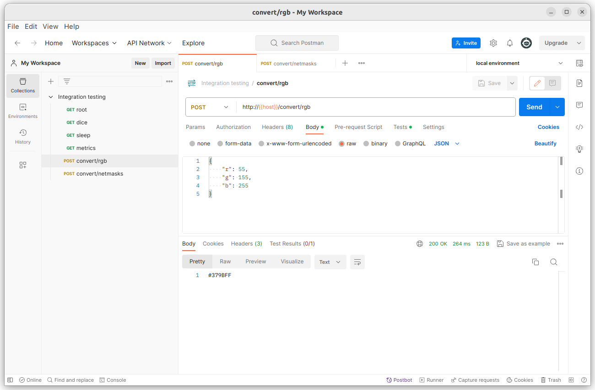
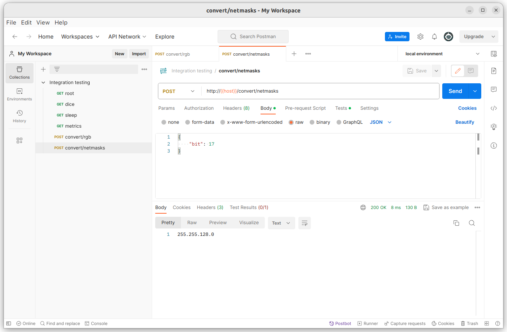

# Rust で Web API をつくる

目標は、REST API です。現段階では REST になってないので Web API としています。

## 開発環境

マシンごとに Rust 環境を構築しなくても良くなるので、VS Code Dev Container でローカルマシン内に OCI コンテナを立て Rust 開発ツールを導入します。

VS Code Dev Container を入れ以下のファイルを .devcontainer/devcontainer.json として保存すると利用できます。初回は時間がかかりますが二回目以降は Attach するだけで大丈夫です。

```json
{
  "name": "Ubuntu",
  "image": "mcr.microsoft.com/devcontainers/base:jammy",
  "features": {
    "ghcr.io/devcontainers/features/rust:1": {
      "version": "latest",
      "profile": "default"
    }
  }
}
```

VS Code Dev Container は、とっても楽なのでおすすめです。

## DesignDoc

[DesignDoc](./Docs/DesignDoc.md)

## Mac 利用時の注意点

Homebrew で Rust をインストールすると、フォーミュラが更新されない限りインストール時点のバージョンになります。そして Rust は頻繁に更新します。すると rustup と rustc のバージョンが合わない期間が出てきます。この結果、rust-analyzer の挙動がおかしくなることがあります。うちでは proc macros のエラーでコード内の macro が見つからなくなりました。

まとめ、もしコンテナを使わずに Mac に Rust のインストールするなら、[公式](https://www.rust-lang.org/tools/install)のやり方が良いとです。

```shell
curl --proto '=https' --tlsv1.2 -sSf https://sh.rustup.rs | sh
```

そして、Rust のバージョンアップは以下でできます。

```shell
rustup update
```

プロジェクト内のクレートなどのバージョンアップは以下でできます。

```shell
cd "your project"
cargo update
```

Homebrew で Rust をインストールすると依存関係でその他のソフトウェアもインストールされます。うちでは llvm と zx が入り、これらが他のソフトウェアの依存先にもなってしまい綺麗にするのに手間がかかりました。そういった意味でも初手公式が望ましいです。

## 進捗

| Method | URI               | Return | Return ex                                           |
| ------ | ----------------- | ------ | --------------------------------------------------- |
| GET    | /dice             | json   | `{ "dice": 2 }`                                     |
| GET    | /sleep/{:int}     | json   | `{ "sleep_duration": 3 }`                           |
| GET    | /metrics          | json   | `{ "cpu_load": "2,1,2", "storage": "xxxxxxxxxxx" }` |
| POST   | /convert/rgb      | string | `#12d3e4`                                           |
| POST   | /convert/v4prefix | string | `255.245.0.0`                                       |




